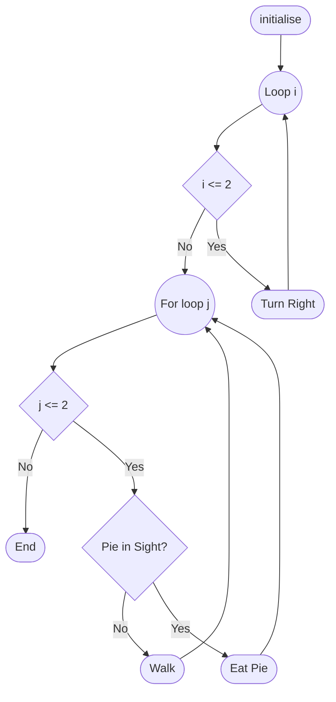


# Software Testing - Exam Paper - 2022 - Summer

**Time Allowed**: 2 hours

**Instructions**:  Answer any 3 questions. All questions carry equal marks

**Marks and marks will be scaled to 100.**

The use of programmable or text storing calculators is expressly forbidden.

Please note that where a candidate answers more than the required number of questions, the examiner will mark all questions attempted and then select the highest scoring ones.  

There are no additional requirements for this paper.

## Question 1 - (Total 33 Marks)

### Question 1 Part 1 - (11 Marks)

Explain your understanding of the goal of software testing and the implications of the goal of software testing?

#### Answer based on ... internet

Software testing is a critical part of the software development process that involves evaluating a software application to identify any defects, errors, or discrepancies from expected behavior. The goal of software testing is to ensure that the software functions correctly and meets the specified requirements, as well as to verify its reliability, performance, security, and usability.

Here are some key aspects of the goal of software testing and its implications:

1. **Quality Assurance**: Software testing helps in ensuring the quality of the software by detecting and rectifying bugs and defects early in the development cycle. This leads to a better, more reliable product.

2. **Verification and Validation**: Testing is used to verify that the software meets its requirements (verification) and to validate that it fulfills the needs and expectations of the users (validation).

3. **Risk Mitigation**: By identifying issues and vulnerabilities in the software, testing helps mitigate risks associated with deployment and use, such as crashes, security breaches, and data loss.

4. **Improving Software Design**: Testing can reveal weaknesses or limitations in the software design, prompting improvements or redesigns that can enhance overall performance and maintainability.

5. **Cost-Effectiveness**: While testing can add to the cost and time of development, it ultimately saves money by catching issues early and avoiding costly post-release problems such as patching, legal issues, or customer dissatisfaction.

6. **Compliance**: In many industries, software must comply with legal, regulatory, or industry standards. Testing ensures that the software adheres to these requirements.

7. **User Confidence and Satisfaction**: Properly tested software is more reliable and user-friendly, which leads to greater user confidence and satisfaction.

8. **Continuous Improvement**: Software testing is a continuous process that encourages improvement and iteration, leading to the development of better products over time.

In summary, the goal of software testing is to ensure that software functions correctly, meets specified requirements, and provides a positive user experience. It plays a crucial role in risk mitigation, quality assurance, and continuous improvement throughout the software development lifecycle.

#### Answer based on Lecturer Notes

Software testing aims to increase users' confidence that the software system behaves correctly under all circumstances of interest. The process of software testing involves verifying the software's performance against specified requirements and ensuring that it can handle various scenarios and edge cases.

The purpose of testing is not to prove that a program has bugs but to find defects and assess the system's quality. While testing can identify the presence of defects, it cannot prove their absence, as there may still be undiscovered bugs.

The implications of the goal of software testing include:

- **Acceptable Level of Confidence**: An acceptable level of confidence must be defined based on how confident the user needs to be that the software works. This can be stated numerically (e.g., the number of tests successfully completed) or based on residual defect discovery rate (e.g., no Priority 1 bugs found in the last 5 days of testing).

- **Correct Behavior Definition**: Correct behavior must be clearly defined in terms of what the software should do, based on functional requirements. This requires comparing actual behavior with specified behavior and understanding use cases and scenarios.

- **Circumstances of Interest**: Circumstances of interest must be defined to test the software realistically within the context in which it will operate. This involves predicting how the software will be used, considering different user patterns, usage spikes (e.g., processing 10,000 orders each day during December and 1,000 each day for the rest of the year), and projected growth of the business.

- **Testing Process**: The testing process includes conducting tests, documenting the results, analyzing the process, making corrections, and repeating the process as needed.

Overall, the goal of software testing is to ensure that the system behaves correctly under various conditions, providing a reliable and satisfactory experience for users while identifying and addressing defects as early as possible in the development process.

### Question 1 Part 2 - (11 Marks)

Do you think scenarios and use cases can be used for software testing, explain your answer?  

Scenarios and use cases can be used for software testing as they provide a structured approach to defining the expected behavior of the software system under different conditions. Scenarios and use cases help in identifying the various interactions between the user and the system, as well as the system's responses to different inputs and actions.  

### Question 1 Part 3 - (11 Marks)

Explain your understanding of the big bang approach to software testing. Do you think you will ever use this approach in the future, explain your answer?

The big bang approach to software testing is a testing strategy where all parts of a system are combined and tested simultaneously, typically after the development phase is complete. This approach involves waiting until the entire system is developed before beginning integration and system testing.

**Understanding of Big Bang Approach:**

- **All-at-Once Testing:** In the big bang approach, testing is done after all components or modules have been integrated, and the entire system is tested as a whole.
- **Limited Iterative Feedback:** Because testing happens at the end of the development process, there is limited opportunity for iterative feedback during development.
- **Risk of Compounding Issues:** Bugs in one module can affect the entire system, making it challenging to isolate issues and identify their root causes.

**Considerations for Using the Big Bang Approach:**

- **Suitability for Small Projects:** The big bang approach can be effective for small, simple projects where all components are easy to integrate and test simultaneously.
- **High Risk for Large Projects:** For larger, complex projects, this approach carries high risks as issues may be compounded and harder to isolate.
- **Limited Early Feedback:** The lack of early testing feedback may lead to discovering issues late in the development process, potentially increasing the cost of fixing them.
- **Alternative Approaches:** Incremental and iterative approaches, such as agile and continuous integration, provide more opportunities for early feedback and issue resolution.

In conclusion, while the big bang approach may be suitable for small projects, it is generally not advisable for larger, complex systems due to the risk of compounding issues and the limited opportunity for early feedback. Instead, incremental and iterative approaches such as agile and continuous integration are often preferred.

## Question 2 - (Total 33 Marks)

```java
public void walkFirstColOfGridEatingPies(Grid grid)
{
    initialize();
    for(int i = 1; i <= 2; i++)
    {
        turn("right");
    }

    for(int j = 1; j <= 2; j++)
    {
        if(grid.pieInSight(this) == true)
        {
            eatPie(grid);
        }
        else
        {
            walk(grid);
        }
    }
}
```

> Figure 1

### Question 2 Part 1 - (11 Marks)

Develop a control flow-graph for the code shown in Figure 1 below and determine the complexity.



$M = E - N + 2$  
where:

- $M$ is the complexity
- $E$ is the number of edges
- $N$ is the number of nodes

$M = 12 - 10 + 2 = 4$

Suppose software testing has been employed so that TER1 = 1 and TER2 = 1, would you recommend further testing and explain your answer.

***A ANSWER FROM INTERNET***
Given the testing effectiveness ratios (TER1 = 1 and TER2 = 1), which indicate full coverage in their respective scopes, it is still advisable to consider further testing due to the following reasons:

Boundary and Edge Cases: TER1 and TER2 might not cover all edge cases and boundary conditions, which could reveal additional issues.
Integration Testing: Ensure that the interaction between Grid and PieEater is tested to uncover potential issues in the combined functionality.
Real-World Scenarios: Tests may not fully capture real-world usage and user behavior, which could lead to unexpected issues.
Different Configurations: Testing the Grid class with various row and column sizes can help identify potential problems related to different grid shapes and sizes.
In conclusion, while the current testing results suggest effective coverage, further testing is recommended to enhance the robustness and reliability of the code.

### Question 2 Part 2 - (11 Marks)

#### Lines

No need to number blank lines or lines with curly braces.

| # | Code                                |
|---|-------------------------------------|
| 1 | `initialize();`                     |
| 2 | `for (int i = 1; i <= 2; i++)`      |
| 3 | `turn("right");`                    |
| 4 | `for (int j = 1; j <= 2; j++)`      |
| 5 | `if(grid.pieInSight(this) == true)` |
| 6 | `eatPie(grid);`                     |
| 7 | `walk(grid);`                       |
| 8 | **END**                             |

Develop the branch table for the code shown in Figure 1.

#### Branch Table

| Branch No. | From Line # | To Line # | Branch Type        | From Line                                     | To Line                               |
|:-----------|:------------|:----------|:-------------------|:----------------------------------------------|:--------------------------------------|
| 1          | 1           | 2         | Unconditional      | `initialize();`                               | `for (int i=1; i <= 2; i++)`          |
| 2          | 2           | 3         | Conditional Loop   | `for (int i=1; i <= 2; i++)` is True          | `turn ("right");`                     |
| 3          | 2           | 4         | Conditional Loop   | `for (int i=1; i <= 2; i++)` is False         | `for (int j=1; j <= 2; j++)`          |
| 4          | 3           | 2         | Unconditional      | `turn ("right");`                             | `for (int i=1; i <= 2; i++)`          |
| 5          | 4           | 5         | Conditional Loop   | `for (int j=1; j <= 2; j++)` is True          | `if(aGrid.pieInSight (this) == true)` |
| 6          | 4           | 8         | Conditional Loop   | `for (int j=1; j <= 2; j++)` is False         | **END**                               |
| 7          | 5           | 6         | Conditional Branch | `if(grid.pieInSight (this) == true)` is True  | `eatPie(aGrid);`                      |
| 8          | 6           | 7         | Conditional Branch | `if(grid.pieInSight (this) == true)` is False | `walk(aGrid);`                        |
| 9          | 6           | 4         | Unconditional      | `eatPie(grid);`                               | `for (int j=1; j <= 2; j++)`          |
| 10         | 7           | 4         | Unconditional      | `walk(grid);`                                 | `for (int j=1; j <= 2; j++)`          |

### Question 2 Part 3 - (11 Marks)

Develop the block table for the code shown in `Figure 1`.

#### Block Table

| Block Number | Start Line | End Line | Start Line Code                      | End Line Code    |
|--------------|------------|----------|--------------------------------------|------------------|
| 1            | 1          | 1        | `initialize();`                      | `...`            |
| 2            | 2          | 3        | `for (int i = 1; i <= 2; i++)`       | `turn("right");` |
| 3            | 4          | 7        | `for (int j = 1; j <= 2; j++)`       | `walk(grid);`    |
| 4            | 5          | 7        | `if(aGrid.pieInSight(this) == true)` | `walk(aGrid);`   |

## Question 3 - Stubs - (Total 33 Marks)

An OvertimeHoursProcessor component has a method called processOvertimeHours which contains business logic about processing of overtime hours worked. The code for the processOvertimeHours is shown in Figure 2 below.

```java
package io.github.username.exam.code;
import java.util.Calendar;

public class OvertimeHoursProcessor {

    public OvertimeHoursProcessor() {}// Default constructor

    public Boolean processOvertimeHours(String overtimeHoursFile) {
        //First piece of business logic is to check the overtimeHoursFile has
        // valid extension.
        if (overtimeHoursFile.endsWith(".data"))
        {
            //Next piece of business logic is to check that it is a Saturday
            // as hours worked this day are overtime rate.
            Calendar cal = Calendar.getInstance();
            if (cal.get(Calendar.DAY_OF_WEEK) == Calendar.SATURDAY))
            {
                readTheOvertimeHoursFile();
                return true;
            }
            else
            {
                return false;
            }
        }
        else
        {
            return false;
        }
    }

    public void readTheOvertimeHoursFile() {
        /* ... */
    }
    /* ... */
}
// This code is under construction  and is not currently needed
// to unit test the business logic in the processOvertimeHours method.
```

> Figure 2

### Question 3 Part 1 - (8 Marks)

Explain what a stub is and why you need to utilize stubs to unit test code?

A stub is a piece of code that simulates the behaviour of a component that the system under test depends on.  For example the component may not be available or may have not been implemented yet.  It may not be necessary to use a real implementation of the component such as a database or web service in a unit test to test a system or piece of the system/code a stub would be suitable.

### Question 3 Part 2 - (12 Marks)

Refactor the OvertimeHoursProcessor to make it testable by introducing a layer of indirection to avoid the dependency i.e. write **code** or **pseudocode**. You refactoring should include adding an interface which will allow use of a configurable stub in the unit tests.

```java
package io.github.username.exam.code;

/**
 * Interface for the OvertimeHoursFileProcessor
 */
public interface OvertimeHoursFileProcessor {

    public String getOvertimeHoursFile();
    public void setOvertimeHoursFile(String overtimeHoursFile);
    public void readTheOvertimeHoursFile();
}

/**
 * OvertimeHoursFileProcessorStub
 */
import org.apache.commons.logging.Log;

public class OvertimeHoursFileProcessorStub implements OvertimeHoursFileProcessor {

    private static final Log log = LogFactory.getLog(OvertimeHoursFileProcessorStub.class);
    private String overtimeHoursFile;

    public String getOvertimeHoursFile() {
        return "overtimeHoursFile";
    }

    public void setOvertimeHoursFile(String overtimeHoursFile) {
    }

    public boolean isOvertimeHoursFileValid() {
        return true;
    }

    public void readTheOvertimeHoursFile() {
        log.info("Stub for Reading the overtime hours file");
    }
}

import java.util.Calendar;

/**
 * Refactored OvertimeHoursProcessor
 */
public class OvertimeHoursProcessor {

    private final OvertimeHoursFileProcessor overtimeHoursFileProcessor;

    public OvertimeHoursProcessor(OvertimeHoursFileProcessor overtimeHoursFileProcessor) {
        this.overtimeHoursFileProcessor = overtimeHoursFileProcessor;
    }

    public Boolean processOvertimeHours() {
        if (!overtimeHoursFileProcessor.isOvertimeHoursFileValid())
            return false;

        Calendar cal = Calendar.getInstance();
        if (!cal.get(Calendar.DAY_OF_WEEK) == Calendar.SATURDAY))
            return false;

        overtimeHoursFileProcessor.readTheOvertimeHoursFile();
        return true;
    }
}
```

### Question 3 Part 3 - (13 Marks)

Write code or pseudocode for three unit tests to test the business logic in the processOvertimeHours method. Write code or pseudocode for a configurable stub to be used by your tests utilising constructor injection.

```java
import org.junit.Test;
import static org.junit.Assert.assertTrue;
import static org.junit.Assert.assertFalse;

public class OvertimeHoursProcessorTest {

    @Test
    public void testProcessOvertimeHoursWithValidFile() {
        OvertimeHoursFileProcessorStub stub = new OvertimeHoursFileProcessorStub();
        stub.setOvertimeHoursFile("valid-file.data");
        OvertimeHoursProcessor processor = new OvertimeHoursProcessor(stub);
        assertTrue(processor.processOvertimeHours());
    }

    @Test
    public void testProcessOvertimeHoursWithInvalidFile() {
        OvertimeHoursFileProcessorStub stub = new OvertimeHoursFileProcessorStub();
        stub.setOvertimeHoursFile("in-valid-file.txt");
        OvertimeHoursProcessor processor = new OvertimeHoursProcessor(stub);
        assertFalse(processor.processOvertimeHours());
    }
}
```

## Question 4 - (Total 33 Marks)

### Question 4 Part 1 - (10 Marks)

Explain your understanding of equivalence partitioning.  

### Question 4 Part 2 - (23 Marks)

A software system to accept new stock items in a steel yard accepts the item name followed by a list of different lengths the steel comes in. The specification states that the item name is to be alphabetic 5 to 10 characters long. Each length in metres must be in the range of 1 to 7, whole numbers only. The lengths are to be entered in descending order (biggest length first) with a maximum of 3 lengths allowed to be entered for each item and whole numbers only. A comma is to be used to separate the item name from the lengths and a comma will be used to separate each length and the enter key to be pressed after the last length is entered

Derive the equivalence classes and determine black box test cases based on these and utilise boundary value analysis.

## Paper College Details

College: Technological University Of The Shannon: Midlands Midwest  
Module Title: Software Testing  
Module Code: SODV06001  
Year of Study: 2  
Year: 2022 - Summer  

### Programmes

| Code           | Programme                                          |
|----------------|----------------------------------------------------|
| LC\_KGDVM\_KTH | Bsc. (Honours) Games Design and Development        |
| LC\_KSFDM\_KMY | Bsc. (Honours) Software Development                |
| LC\_KSFDM\_ITH | Higher Certificate in Science Software Development |
| LC\_KISYM\_JMY | Bsc. (Honours) Internet Systems Development        |
| LC\_KISYM\_KMY | Bachelor of Science Internet Systems Development   |
| LC\_KIDMM\_KMY | Bsc. (Honours) Interactive Digital Media           |
| LC\_KCPTM\_JMY | Bsc. Computing                                     |

### Examiners

| Examiner           |          |
|--------------------|----------|
| Mr. Brendan Watson | Internal |
| Mr. Andrew Shields | External |
