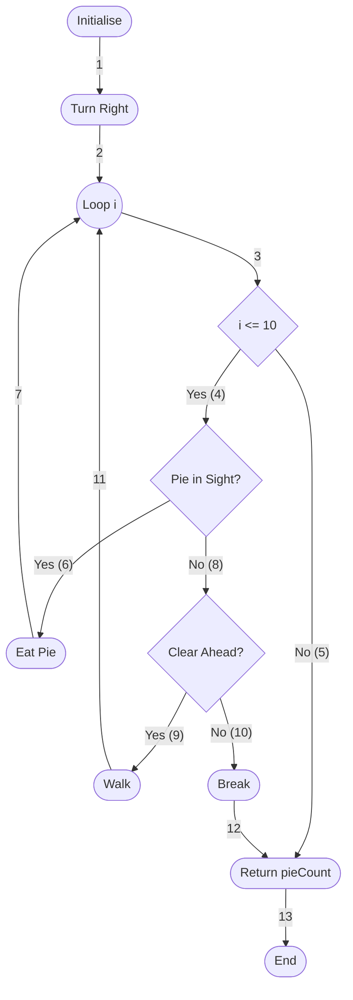

# Software Testing - Exam Paper - 2024 - Summer

**Time Allowed**: 2 hours

**Instructions**:  Answer any 3 questions. All questions carry equal marks

**Marks and marks will be scaled to 100.**

The use of programmable or text storing calculators is expressly forbidden.

Please note that where a candidate answers more than the required number of questions, the examiner will mark all questions attempted and then select the highest scoring ones.

There are no additional requirements for this paper.

## Question 1 - (Total 33 Marks)

### Question 1.A (11 Marks)

Explain the relevance of the goal of software testing if you are asked about software testing in a work placement interview.

### Question 1.B (11 Marks)

What are the levels of software testing? Explain why you think there are a number of levels of software testing.

### Question 1.C (11 Marks)

Explain your understanding of user acceptance testing. Do you think you will be involved in user acceptance testing in the future, explain your answer?

## Question 2 (Total 33 Marks)

```java
public Integer walkAndEatPies(Grid aGrid)
{
  initialise();
  turn("Right");
  for(int i=1; i <= 10; i++)
  {
    if(aGrid.pieInSight(this) == true)
    {
      eatPie(aGrid);
    }
    else
    {
      if(aGrid.clearAhead(this) == true)
      {
        walk(aGrid);
      }
      else
      {
        break;
      }
    }
  }
  return pieCount;
}
```

**Figure 1**  

### Question 2.A (11 Marks)

#### Question 2.A.1

Develop a control flow-graph for the code shown in Figure 1 and determine the complexity.

#### Answer 2.A.1

The control flow-graph for the code shown in Figure 1 is as follows:



The complexity of the control flow-graph can be calculated using the formula:

$M = E - N + 2$

where:

- $M$ is the complexity
- $E$ is the number of edges
- $N$ is the number of nodes

$M = 13 - 11 + 2 = 4$

$$\boxed{M = 4}$$

#### Question 2.A.2

Suppose software testing has been employed so that TER1 = 0.95, would you recommend further testing and explain your answer.

#### Answer 2.A.2

Given the testing effectiveness ratio (TER1 = 0.95), which indicates a high level of coverage, further testing may not be necessary. However, it is advisable to consider additional testing to ensure robustness and reliability, especially in critical or complex systems. Further testing can help identify edge cases, boundary conditions, and potential issues that may not have been covered by the initial tests. It is always beneficial to have a comprehensive testing strategy to minimize the risk of undetected defects and ensure the quality of the software product.

### Question 2.B (11 Marks)

Develop the branch table for the code shown in Figure 1.

### Answer 2.B

**Lines**  

No need to number `blank lines`, `lines with curly braces` or `else` statements.

| #  | Code                                 |
|----|--------------------------------------|
| 1  | `initialise();`                      |
| 2  | `turn("Right");`                     |
| 3  | `for(int i=1; i <= 10; i++)`         |
| 4  | `if(aGrid.pieInSight(this) == true)` |
| 5  | `eatPie(aGrid);`                     |
| 6  | `if(aGrid.clearAhead(this) == true)` |
| 7  | `walk(aGrid);`                       |
| 8  | `break;`                             |
| 9  | `return pieCount;`                   |
| 10 | **END**                              |

**Branch Table**  

| Branch No. | From Line # | To Line # | Branch Type        | From Line                                     | To Line                              |
|:-----------|:------------|:----------|:-------------------|:----------------------------------------------|:-------------------------------------|
| 1          | 1           | 2         | Unconditional      | `initialise();`                               | `turn("Right");`                     |
| 2          | 2           | 3         | Unconditional      | `turn("Right");`                              | `for(int i=1; i <= 10; i++)`         |
| 3          | 3           | 4         | Conditional Loop   | `for(int i=1; i <= 10; i++)` is True          | `if(aGrid.pieInSight(this) == true)` |
| 4          | 3           | 9         | Conditional Loop   | `for(int i=1; i <= 10; i++)` is False         | `return pieCount;`                   |
| 5          | 4           | 5         | Conditional Branch | `if(aGrid.pieInSight(this) == true)` is True  | `eatPie(aGrid);`                     |
| 6          | 4           | 6         | Conditional Branch | `if(aGrid.pieInSight(this) == true)` is False | `if(aGrid.clearAhead(this) == true)` |
| 7          | 5           | 3         | Unconditional      | `eatPie(aGrid);`                              | `for(int i=1; i <= 10; i++)`         |
| 8          | 6           | 7         | Conditional Branch | `if(aGrid.clearAhead(this) == true)` is True  | `walk(aGrid);`                       |
| 9          | 6           | 8         | Conditional Branch | `if(aGrid.clearAhead(this) == true)` is False | `break;`                             |
| 10         | 7           | 3         | Unconditional      | `walk(aGrid);`                                | `for(int i=1; i <= 10; i++)`         |
| 11         | 8           | 9         | Unconditional      | `break;`                                      | `return pieCount;`                   |
| 12         | 9           | 10        | Unconditional      | `return pieCount;`                            | **END**                              |

### Question 2.C (11 Marks)

Develop the block table for the code shown in Figure 1.

### Answer 2.C

Using my **Lines** table from **Answer 2.B**:

| Block Number | Start Line | End Line | Start Line Code              | End Line Code    |   |
|--------------|------------|----------|------------------------------|------------------|---|
| 1            | 1          | 2        | `initialise();`              | `turn("Right");` |   |
| 2            | 3          | 8        | `for(int i=1; i <= 10; i++)` | `break;`         | Note 1  |
| 3            | 9          | 10       | `return pieCount;`           | **END**          |   |
|              |            |          |                              |                  |   |
| 4            | 5          | 5        | `eatPie(aGrid);`             | `eatPie(aGrid);` | Note 2  |
| 5            | 7          | 7        | `walk(aGrid);`               | `walk(aGrid);`   | Note 2  |

**Notes**:

1. The `break;` statement makes it impossible to break up the code into smaller blocks because the `break;` statement is part of the loop.
2. Stricter interpretation of the block table would have the same start and end line code for blocks 4 and 5, but It would be pointless to block to call the same function.
