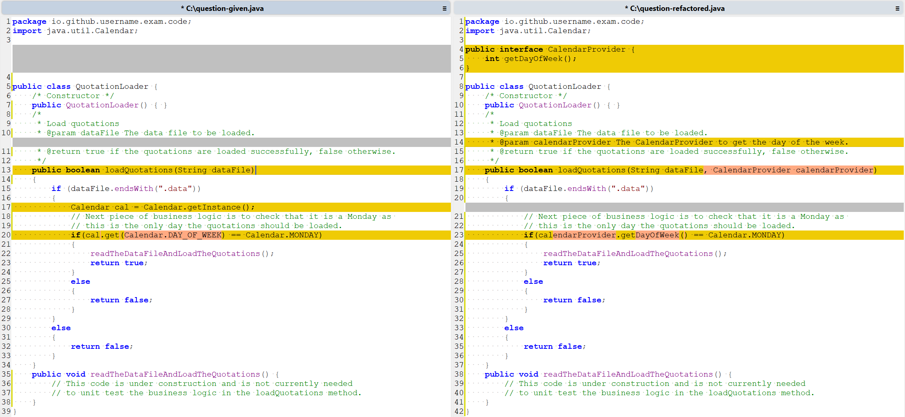

# Software Testing - SODV06010 - Exam Paper - 2024 - Summer

**Time Allowed**: 2 hours

**Instructions**:  Answer any 3 questions. All questions carry equal marks and marks will be scaled to 100.

The use of programmable or text storing calculators is expressly forbidden.

Please note that where a candidate answers more than the required number of questions, the examiner will mark all questions attempted and then select the highest scoring ones.

There are no additional requirements for this paper.

## Question 1 [Total 33 Marks]

### Question 1.A (11 Marks)

Explain the relevance of the goal of software testing if you are asked about software testing in a work placement interview.

### Answer 1.A

The goal of software testing is to ensure that the software product meets the specified requirements, functions correctly, and is free from defects. In a work placement interview, discussing the relevance of this goal is essential to demonstrate an understanding of the importance of software testing in the software development lifecycle. Here are some key points to consider when explaining the relevance of the goal of software testing in a work placement interview:

1. **Quality Assurance:** Software testing plays a critical role in quality assurance by verifying that the software meets the desired quality standards. It helps identify defects, bugs, and issues early in the development process, allowing for timely resolution and ensuring a high-quality product.
2. **Risk Mitigation:** Testing helps mitigate risks associated with software development by identifying potential issues that could impact the software's performance, security, or reliability. By detecting and addressing defects early, testing reduces the likelihood of costly failures in production.
3. **Customer Satisfaction:** Testing ensures that the software functions as intended and meets user expectations. By validating the software against the requirements, testing helps deliver a product that is reliable, user-friendly, and meets customer needs, thereby enhancing customer satisfaction.

### Question 1.B (11 Marks)

What are the levels of software testing? Explain why you think there are a number of levels of software testing.

### Answer 1.B

---

### Question 1.C (11 Marks)

Explain your understanding of user acceptance testing. Do you think you will be involved in user acceptance testing in the future, explain your answer?

### Answer 1.C

**User Acceptance Testing (UAT)** is the final phase of software testing where the software is tested by end-users to ensure that it meets their requirements and is ready for production release. UAT is conducted in a real-world environment to validate the software's functionality, usability, and performance from the user's perspective. The primary goal of UAT is to gain user approval and confidence in the software before it is deployed.


**Figure: Software Requirements** Source: [Software Requirements(https://onion.training/wp-content/uploads/2024/04/Software-Requirements-980x327.png)]

## Question 2 (Total 33 Marks)

```java
public Integer walkAndEatPies(Grid aGrid)
{
  initialise();
  turn("Right");
  for(int i=1; i <= 10; i++)
  {
    if(aGrid.pieInSight(this) == true)
    {
      eatPie(aGrid);
    }
    else
    {
      if(aGrid.clearAhead(this) == true)
      {
        walk(aGrid);
      }
      else
      {
        break;
      }
    }
  }
  return pieCount;
}
```

**Figure 1**  

### Question 2.A (11 Marks)

#### Question 2.A.1

Develop a control flow-graph for the code shown in Figure 1 and determine the complexity.

#### Answer 2.A.1

The control flow-graph for the code shown in Figure 1 is as follows:


The complexity of the control flow-graph can be calculated using the formula:

$M = E - N + 2$

where:

- $M$ is the complexity
- $E$ is the number of edges
- $N$ is the number of nodes

$M = 13 - 11 + 2 = 4$

$$\boxed{M = 4}$$

#### Question 2.A.2

Suppose software testing has been employed so that TER1 = 0.95, would you recommend further testing and explain your answer.

#### Answer 2.A.2

Given the testing effectiveness ratio (TER1 = 0.95), which indicates a high level of coverage, further testing may not be necessary. However, it is advisable to consider additional testing to ensure robustness and reliability, especially in critical or complex systems. Further testing can help identify edge cases, boundary conditions, and potential issues that may not have been covered by the initial tests. It is always beneficial to have a comprehensive testing strategy to minimize the risk of undetected defects and ensure the quality of the software product.

### Question 2.B (11 Marks)

Develop the branch table for the code shown in Figure 1.

### Answer 2.B

**Lines**  

No need to number `blank lines` , `lines with curly braces` or `else` statements.

| #  | Code                                 |
|----|--------------------------------------|
| 1  | `initialise();`                      |
| 2  | `turn("Right");`                     |
| 3  | `for(int i=1; i <= 10; i++)`         |
| 4  | `if(aGrid.pieInSight(this) == true)` |
| 5  | `eatPie(aGrid);`                     |
| 6  | `if(aGrid.clearAhead(this) == true)` |
| 7  | `walk(aGrid);`                       |
| 8  | `break;`                             |
| 9  | `return pieCount;`                   |
| 10 | **END**                              |

**Branch Table**  

- `From Line` and `To Line` are for reference only. They are not part of the branch table.*

| Branch No. | From Line # | To Line # | Branch Type        |   | From Line                                     | To Line                              |
|:-----------|:------------|:----------|:-------------------|---|:----------------------------------------------|:-------------------------------------|
| 1          | 1           | 2         | Unconditional      |   | `initialise();`                               | `turn("Right");`                     |
| 2          | 2           | 3         | Unconditional      |   | `turn("Right");`                              | `for(int i=1; i <= 10; i++)`         |
| 3          | 3           | 4         | Conditional Loop   |   | `for(int i=1; i <= 10; i++)` is True          | `if(aGrid.pieInSight(this) == true)` |
| 4          | 3           | 9         | Conditional Loop   |   | `for(int i=1; i <= 10; i++)` is False         | `return pieCount;`                   |
| 5          | 4           | 5         | Conditional Branch |   | `if(aGrid.pieInSight(this) == true)` is True  | `eatPie(aGrid);`                     |
| 6          | 4           | 6         | Conditional Branch |   | `if(aGrid.pieInSight(this) == true)` is False | `if(aGrid.clearAhead(this) == true)` |
| 7          | 5           | 3         | Unconditional      |   | `eatPie(aGrid);`                              | `for(int i=1; i <= 10; i++)`         |
| 8          | 6           | 7         | Conditional Branch |   | `if(aGrid.clearAhead(this) == true)` is True  | `walk(aGrid);`                       |
| 9          | 6           | 8         | Conditional Branch |   | `if(aGrid.clearAhead(this) == true)` is False | `break;`                             |
| 10         | 7           | 3         | Unconditional      |   | `walk(aGrid);`                                | `for(int i=1; i <= 10; i++)`         |
| 11         | 8           | 9         | Unconditional      |   | `break;`                                      | `return pieCount;`                   |
| 12         | 9           | 10        | Unconditional      |   | `return pieCount;`                            | **END**                              |

### Question 2.C (11 Marks)

Develop the block table for the code shown in Figure 1.

### Answer 2.C

Using my **Lines** table from **Answer 2.B**:

*From `Start Line Code` and `End Line Code` are for reference only. They are not part of the block table.*

| Block Number | Start Line | End Line |   | Start Line Code              | End Line Code    |        |
|--------------|------------|----------|---|------------------------------|------------------|--------|
| 1            | 1          | 2        |   | `initialise();`              | `turn("Right");` |        |
| 2            | 3          | 8        |   | `for(int i=1; i <= 10; i++)` | `break;`         | Note 1 |
| 3            | 9          | 10       |   | `return pieCount;`           | **END**          |        |
|              |            |          |   |                              |                  |        |
| 4            | 5          | 5        |   | `eatPie(aGrid);`             | `eatPie(aGrid);` | Note 2 |
| 5            | 7          | 7        |   | `walk(aGrid);`               | `walk(aGrid);`   | Note 2 |

**Notes**:

1. The `break;` statement makes it impossible to break up the code into smaller blocks because the `break;` statement is part of the loop.
2. Stricter interpretation of the block table would have the same start and end line code for blocks 4 and 5, but It would be pointless to block to call the same function.

## Question 3 - (Stubs) - [Total 33 Marks]

A `QuotationLoader` component has a method called `loadQuotations` which contains business logic about processing of quotation data. The code for `loadQuotations` is
shown in `Figure 2` below

```java
package io.github.username.exam.code;
import java.util.Calendar;

public class QuotationLoader {

    public QuotationLoader() {}// Default constructor

    public Boolean loadQuotations(String dataFile) {
        //First piece of business logic is to check the datafile has a valid extension.
        if (dataFile.endsWith(".data"))
        {
            // Next piece of business logic is to check that it is a Monday as this is
            // the only day the quotations should be loaded.
            Calendar cal = Calendar.getInstance();
            if (cal.get(Calendar.DAY_OF_WEEK) == Calendar.MONDAY))
            {
                readTheDataFileAndLoadTheQuotations();
                return true;
            }
            else
            {
                return false;
            }
        }
        else
        {
            return false;
        }
    }

    public void readTheDataFileAndLoadTheQuotations() {
        // This code is under construction and is not currently needed
        // to unit test the business logic in the loadQuotations method.
        /* ... */
    }
    /* ... */
}
```

**Figure 2**  

## Question 3.A (12 Marks)

Refactor the QuotationLoader to make it testable by introducing a layer of indirection to avoid the dependency i.e. write code or pseudocode. Your refactoring should include adding an interface which will allow use of a configurable stub in the unit tests.

### Answer 3.A

```java
package io.github.username.exam.code;
import java.util.Calendar;

/**
 * Step 1: Introduce an Interface for the File Processing
 * This interface defines the methods required for processing the quotation data file.
 * i.e getter and setter for the file name because loadQuotations method needs to check the file extension
 * and the method readTheDataFileAndLoadTheQuotations() because it is to be unit tested in the loadQuotations method.
*/
public interface CalendarProvider {
    int getDayOfWeek();
}

public interface QuotationFileProcessor {
    String getFileName();
    void readTheDataFileAndLoadTheQuotations();
}

/**
 * Step 2: Refactor the QuotationLoader Class to make it testable
 * The QuotationLoader class is refactored to use the QuotationFileProcessor interface through constructor injection.
*/
public class QuotationLoader {

    /**
     * Field to hold the QuotationFileProcessor by it's interface.
     */
    private final QuotationFileProcessor quotationFileProcessor;
    /**
     * Field to hold the CalendarProvider by it's interface.
     */
    private final CalendarProvider calendarProvider;

    /**
     * Constructor to inject the QuotationFileProcessor.
     * @param quotationFileProcessor The QuotationFileProcessor implementation.
     * @param calendarProvider The CalendarProvider implementation.
     */
    public QuotationLoader(QuotationFileProcessor quotationFileProcessor, CalendarProvider calendarProvider) {
        this.calendarProvider = calendarProvider;
        this.quotationFileProcessor = quotationFileProcessor;
    }

    /**
     * Step 3: Refactor the loadQuotations method to use the QuotationFileProcessor field.
     * */
    public Boolean loadQuotations()
    {
        //First piece of business logic is to check the datafile has a valid extension.
        if (quotationFileProcessor.getFileName().endsWith(".data"))  // Using quotationFileProcessor.getFileName() instead of dataFile
        {
            // Next piece of business logic is to check that it is a Monday as this is
            // the only day the quotations should be loaded.
            if(calendarProvider.getDayOfWeek() == Calendar.MONDAY)
            {
                quotationFileProcessor.readTheDataFileAndLoadTheQuotations();// Using quotationFileProcessor.readTheDataFileAndLoadTheQuotations() instead of readTheDataFileAndLoadTheQuotations()
                return true;
            }
            else
            {
                return false;
            }
        }
        else
        {
            return false;
        }
    }
}
```



**A better less complex `loadQuotations` method**  

```java
/* ... */
public class QuotationLoader {
    /* ... */
    public Boolean loadQuotations()
    {
        if (!quotationFileProcessor.getFileName().endsWith(".data"))
            return false;

        if(!calendarProvider.getDayOfWeek() == Calendar.MONDAY)
            return false;

        quotationFileProcessor.readTheDataFileAndLoadTheQuotations();
        return true;
    }
}
```

**Before and After Refactoring**  

## Question 3.B (13 Marks)

Write code or pseudocode for three unit tests to test the business logic in the loadQuotations method. Write code or pseudocode for a configurable stub to be used by your tests utilising constructor injection.

### Answer 3.B

```java
package io.github.username.exam.code;
import java.util.Calendar;

public class QuotationFileProcessorStub implements QuotationFileProcessor {

    private String fileName;
    public String getFileName()
    {
        System.out.println("Getting file name");
        return fileName;
    }
    public void setFileName(String fileName)
    {
        System.out.println("Setting file name: " + fileName);
        this.fileName = fileName;
    }
    public void readTheDataFileAndLoadTheQuotations()
    {
        System.out.println("Reading and loading quotations from file");
    }
}
public class CalendarProviderStub implements CalendarProvider {

    private int dayOfWeek;
    public int getDayOfWeek()
    {
        System.out.println("Getting day of week");
        return dayOfWeek;
    }
    public void setDayOfWeek(int dayOfWeek)
    {
        System.out.println("Setting day of week: " + dayOfWeek);
        this.dayOfWeek = dayOfWeek;
    }
}
```

```java
import org.junit.Test;
import static org.junit.Assert.assertTrue;
import static org.junit.Assert.assertFalse;

public class OvertimeHoursProcessorTest {

    @Test
    public void testQuotationLoaderWithValidFileOnValidDay() {
        QuotationFileProcessorStub fileProcessorStub = new QuotationFileProcessorStub();
        fileProcessorStub.setFileName("valid-data-file.data");

        CalendarProviderStub calendarStub = new CalendarProviderStub();
        calendarStub.setDayOfWeek(Calendar.MONDAY);

        QuotationLoader loader = new QuotationLoader(fileProcessorStub, calendarStub);
        assertTrue(loader.loadQuotations());
    }

    @Test
    public void testQuotationLoaderWithInvalidFileOnValidDay() {
        QuotationFileProcessorStub fileProcessorStub = new QuotationFileProcessorStub();
        fileProcessorStub.setFileName("invalid-data-file.invalid");

        CalendarProviderStub calendarStub = new CalendarProviderStub();
        calendarStub.setDayOfWeek(Calendar.MONDAY);

        QuotationLoader loader = new QuotationLoader(fileProcessorStub, calendarStub);
        assertFalse(loader.loadQuotations());
    }

    @Test
    public void testQuotationLoaderWithValidFileOnInvalidDay() {
        QuotationFileProcessorStub fileProcessorStub = new QuotationFileProcessorStub();
        fileProcessorStub.setFileName("valid-data-file.data");

        CalendarProviderStub calendarStub = new CalendarProviderStub();
        calendarStub.setDayOfWeek(Calendar.Sunday);

        QuotationLoader loader = new QuotationLoader(fileProcessorStub, calendarStub);
        assertFalse(loader.loadQuotations());
    }
}
```

## Question 3.C (8 Marks)

Explain what is meant in unit testing by saying that you configured the fake to make happy noises for the test.

### Answer 3.C

In unit testing, configuring the fake to make happy noises means setting up the fake object (stub or mock) to return positive or successful responses during the test. This involves configuring the fake object to simulate the desired behavior or outcome that will satisfy the test conditions. By making the fake object produce happy noises, we ensure that the test scenario is executed successfully and the test case passes.

```java
package io.github.username.exam.code;
import java.util.Calendar;

public class CalendarProviderHappyStub implements CalendarProvider {

    public int getDayOfWeek()
    {
        System.out.println("Getting a Happy day of week, so the test will pass");
        return Calendar.MONDAY;
    }
}

public class CalendarProviderMiserableStub implements CalendarProvider {

    public int getDayOfWeek()
    {
        System.out.println("Getting A Miserable day of week, so the test will fail");
        return Calendar.SUNDAY;
    }
}
```

## Question 4 [Total 33 Marks]

### Question 4.A (10 Marks)

Explain why consideration of Boundary Value Analysis is useful when determining tests cases for the Equivalence Classes/Partitions you identify. Use a simple example to illustrate your answer.

### Answer 4.A

Boundary Value Analysis (BVA) is a crucial technique in software testing that focuses on the values at the boundaries of equivalence classes or partitions. This method is particularly useful because defects are more likely to occur at the edges of input ranges rather than in the middle. By testing these boundary values, we can more effectively identify potential issues in the software.

BVA aligns with the principles of functional testing and structural testing. Functional testing checks the system's functionality from the user's perspective, while structural testing ensures that every part of the code is executed. BVA helps achieve these goals by ensuring that boundary conditions, which are critical for both functional correctness and structural integrity, are thoroughly tested.

**Why BVA is Useful:**

1. **Error Detection:** Boundary values are more prone to errors. Testing these values helps in detecting defects that might not be found when testing within the middle of the range.
2. **Efficiency:** It reduces the number of test cases needed while still maintaining a high probability of finding defects.
3. **Coverage:** Ensures that all edge cases are tested, providing better coverage of the input domain.

**Example:**
Consider a software application that accepts an integer input between 1 and 100 (inclusive).

- **Equivalence Classes:**
  - Valid input: 1 to 100
  - Invalid input: less than 1, greater than 100
- **Boundary Values:**
  - Just below the lower boundary: 0
  - Lower boundary: 1
  - Just above the lower boundary: 2
  - Just below the upper boundary: 99
  - Upper boundary: 100
  - Just above the upper boundary: 101

**Test Cases:**

1. Test with the value 1 (lower boundary).
2. Test with the value 0 (just below the lower boundary).
3. Test with the value 2 (just above the lower boundary).
4. Test with the value 100 (upper boundary).
5. Test with the value 99 (just below the upper boundary).
6. Test with the value 101 (just above the upper boundary).

**Additional Considerations:**
While BVA primarily focuses on boundary values, it can also be useful to consider other types of test cases such as:

- **Negative Values:** Testing with negative values (e.g., -1) can help ensure that the application correctly handles invalid inputs.
- **Even/Odd Values:** Testing with even and odd values within the valid range (e.g., 2, 3, 98, 99) can help identify any issues related to specific types of inputs.
- **Non-Integer Values:** Testing with non-integer values (e.g., 1.5) can help verify the application's handling of non-integer inputs.

By focusing on these boundary values and additional considerations, we can ensure that the application correctly handles the edge cases, thereby improving the reliability and robustness of the software.

### Question 4.B (23 Marks)

A shopping website offers different discounts depending upon each transaction made by the customer. The user enters the integer value of the purchase amount in Euro, then presses the Enter button. For example if a purchase amount is in the range €1 to €10 then no discount is displayed, a purchase over €10 and up to €300 have 10% discount calculated and displayed. Purchase amounts between €301 and up to €500 have 15% discount calculated and displayed, and purchases over €500 have a 20% discount calculated and displayed. The maximum purchase amount that can be entered is €1000 and the minimum amount is €1 and invalid input of any kind results in the warning message Invalid Input.

Derive the equivalence classes and determine black box test cases based on these and utilise boundary value analysis.

### Answer 4.B

Identifying relevant terms from the question for Equivalence Partitioning and Boundary Value Analysis:

A shopping website offers different `discounts` depending upon each transaction made by the customer. The user enters the `integer value` of the `purchase amount` in Euro, then presses the Enter button. For example if a purchase amount is in the `range €1 to €10` then `no discount` is displayed, a purchase over `€10 and up to €300` have `10% discount` calculated and displayed. Purchase amounts `between €301 and up to €500` have `15% discount` calculated and displayed, and purchases `over €500` have a `20% discount` calculated and displayed. The `maximum purchase amount that can be entered is €1000` and the `minimum amount is €1` and `invalid input of any kind` results in the warning message `Invalid Input` .

1. **Valid Input:**
   - Class 1: €1 to €10 (No discount)
   - Class 2: €11 to €300 (10% discount)
   - Class 3: €301 to €500 (15% discount)
   - Class 4: €501 to €1000 (20% discount)
2. **Invalid Input:**
   - Class 5: Less than €1
   - Class 6: Greater than €1000
   - Class 7: Non-integer values (e.g., strings, special characters)

**Boundary Value Analysis**  

For each equivalence class, we will identify the boundary values and create test cases accordingly.

**Test Cases**  

1. **Class 1: €1 to €10 (No discount)**
   - Lower boundary: €1
   - Just above the lower boundary: €2
   - Just below the upper boundary: €9
   - Upper boundary: €10
2. **Class 2: €11 to €300 (10% discount)**
   - Lower boundary: €11
   - Just above the lower boundary: €12
   - Just below the upper boundary: €299
   - Upper boundary: €300
3. **Class 3: €301 to €500 (15% discount)**
   - Lower boundary: €301
   - Just above the lower boundary: €302
   - Just below the upper boundary: €499
   - Upper boundary: €500
4. **Class 4: €501 to €1000 (20% discount)**
   - Lower boundary: €501
   - Just above the lower boundary: €502
   - Just below the upper boundary: €999
   - Upper boundary: €1000
5. **Class 5: Less than €1 (Invalid Input)**
   - Just below the lower boundary: €0
   - Just below the lower boundary: €0.5
   - Negative value: -€1
6. **Class 6: Greater than €1000 (Invalid Input)**
   - Just above the upper boundary: €1001
7. **Class 7: Non-integer values (Invalid Input)**
   - String input: "abc"
   - Special character input: "@#$"

**Equivalence Classes:**  

| Equiv classes | Criteria           | Valid/Invalid |
|---------------|--------------------|---------------|
| E1            | €1 to €10          | Valid         |
| E2            | €11 to €300        | Valid         |
| E3            | €301 to €500       | Valid         |
| E4            | €501 to €1000      | Valid         |
| E5            | Less than €1       | Invalid       |
| E6            | Greater than €1000 | Invalid       |
| E7            | Non-integer values | Invalid       |

**Black Box Test Cases:**  

| Test case |   Input | Output                         | Equivalence class covered |
|-----------|--------:|--------------------------------|---------------------------|
| TC1       |      €1 | No discount                    | E1                        |
| TC2       |      €2 | No discount                    | E1                        |
| TC3       |      €9 | No discount                    | E1                        |
| TC4       |     €10 | No discount                    | E1                        |
| TC5       |     €11 | 10% discount                   | E2                        |
| TC6       |     €12 | 10% discount                   | E2                        |
| TC7       |    €299 | 10% discount                   | E2                        |
| TC8       |    €300 | 10% discount                   | E2                        |
| TC9       |    €301 | 15% discount                   | E3                        |
| TC10      |    €302 | 15% discount                   | E3                        |
| TC11      |    €499 | 15% discount                   | E3                        |
| TC12      |    €500 | 15% discount                   | E3                        |
| TC13      |    €501 | 20% discount                   | E4                        |
| TC14      |    €502 | 20% discount                   | E4                        |
| TC15      |    €999 | 20% discount                   | E4                        |
| TC16      |   €1000 | 20% discount                   | E4                        |
| TC17      |      €0 | Invalid Input                  | E5                        |
| TC18      |     -€1 | Invalid Input                  | E5                        |
| TC19      |   €1001 | Invalid Input                  | E6                        |
| TC20      |   "abc" | Invalid Input                  | E7                        |
| TC21      |   "@#$" | Invalid Input                  | E7                        |
| TC22      |    €1.5 | No discount?                   | E1                        |
| TC23      |  €1.525 | No discount or Invalid Input?  | E1                        |
| TC24      | €500.50 | 20% discount or Invalid Input? | E4                        |

By focusing on these boundary values and equivalence classes, we can ensure that the application correctly handles the edge cases, thereby improving the reliability and robustness of the software.

## Paper College Details

College: Technological University of the Shannon: Midlands Midwest  
Module Title: Software Testing  
Module Code: SODV06010  
Year of Study: 2  
Year: 2024 - Summer  
Code on Paper: 7cde5a5e  
Timestamp: 2024-05-23 14:00
Filename: 2024-software-testing-sodv06010-solution.md

### Programmes

| Code         | Programme                                   |
|--------------|---------------------------------------------|
| LC_KMWCM_KMY | Bsc. (Honours) Mobile and Web Computing     |
| LC_KSOFM_KMY | Bsc. (Honours) Software Development         |
| LC_KCPTM_JMY | Bsc. Computing                              |
| LC_KMWCM_JMY | Bsc. Mobile and Web Computing               |
| LC_KISYM_JMY | Bsc. Internet Systems Development           |
| LC_KISYM_KMY | Bsc. (Honours) Internet Systems Development |

### Examiners

| Examiner           |          |
|--------------------|----------|
| Mr. Brendan Watson | Internal |
| Mr. Frank Glavin   | External |
