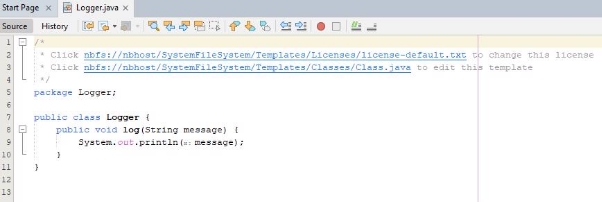
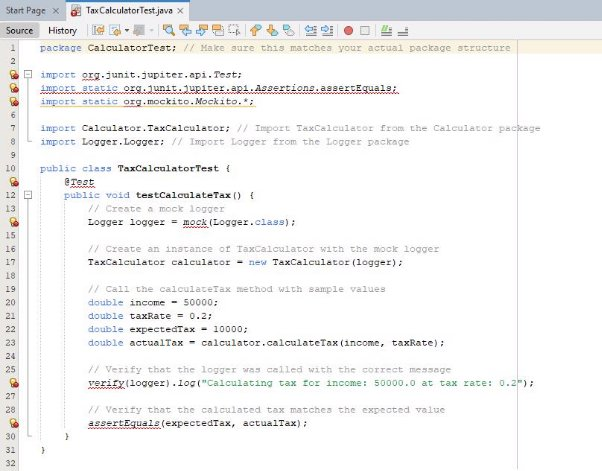

Software Testing Assignment 2 K00283736 

(A) 

Robust unit tests have multiple essential characteristics that guarantee their efficiency in confirming the operation of software element. The following six qualities are crucial: 

**Independence:** Every unit test to stand alone from the others that is, the result of one test ought not to be influenced by the outcome of another. This improves the testing processes control and increases the validity of test findings. 

**Coverage:** Well written unit tests offer thorough coverage of the code they are examining. To make sure every facet of functioning is confirmed, they should experiment with different iterations of the code, such as edge situations and boundary conditions. 

**Isolation:** To test a single unit of code independently of other components or dependencies, unit tests must be isolated. This stops cascade failures and makes problem identification easier. 

**Maintainability:** Unit tests should be simple to update and maintain as the codebase changes. This entails structuring the tests logically and minimising their reliance on implementation specifics. 

**Quick Execution:** As part of the development workflow, effective unit tests can be running frequently due to their rapid execution. Quick running tests incentivize developers to run them frequently, enabling prompt feedback on modifications to the code. 

**Clarity:** Unit tests should be easily understood by developers so that their goal and outcomes may be easily interpreted. Unit tests are made clearer by having descriptive assertions and well-defined tests names. 

(B) 

Business Logic (TaxCalculator.java)

- Based on specified income and tax rate, the TaxCalculator class computes taxes. 
- It includes a calculateTax (double income, double tax rate) method that multiplies the income by the tax rate in order to determine the tax. 
- When calculating taxes, dependency injection is utilized to supply an instance of the Logger class for logging messages. 

Dependency (Logger.java) 

- The TaxCalculator class can log information thanks to the Logger class. 
- To print messages to the console, it has a log(String message) method. 

Unit Tests (TaxCalculatorTest.java) 

- The ‘TaxCalculatorTest’ class tests the ‘calculateTax’ function of the ‘TaxCalculator’ class to ensure that it behaves as intended. 
- To isolate the test, a dummy instance of the ‘Logger’ class is created using Mockito. 
- The ‘testCalculateTax function calls the ‘calculateTax method with values after creating an instance of ‘TaxCalculator. 
- It indicates that the expected value of the calculated tax is fulfilled, and it checks that the loggers ‘log’ method was called with the right message.  
