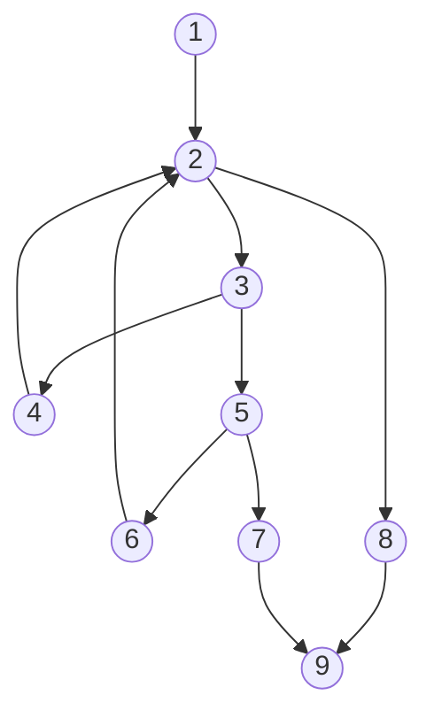

# Example Of Control Flow Graph

<table><thead><tr><th>Source Code</th><th>Control Flow Graph</th></tr></thead><tbody><tr><td>

```cpp
int binarySearch(int x, int v[], int n)
{
    /*1*/int low, high, mid;
    /*1*/low= 0;
    /*1*/high = n - 1;
    while (low <= high)/*2*/
    {
        /*3*/mid= (low + high) /2;
        /*3*/if (x < v[mid])
            high = mid - 1;/*4*/
        /*5*/else if (x > v[mid])
            low= mid + 1;/*6*/
        /*7*/else return mid;
    }
    return -1;/*8*/
}/*9*/
```

</td><td>



</td></tr></tbody></table>

[Example of Control Flow Graph](https://www.researchgate.net/figure/Example-of-Control-Flow-Graph_fig5_4065402)

---
