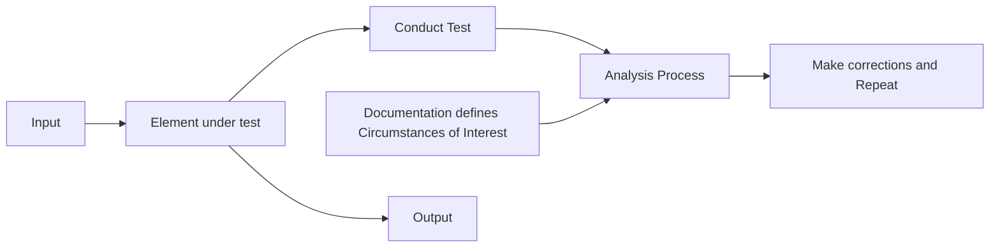
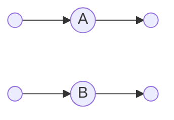
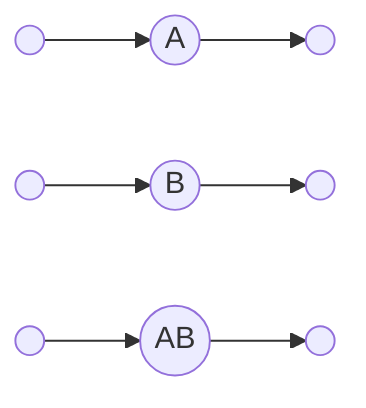
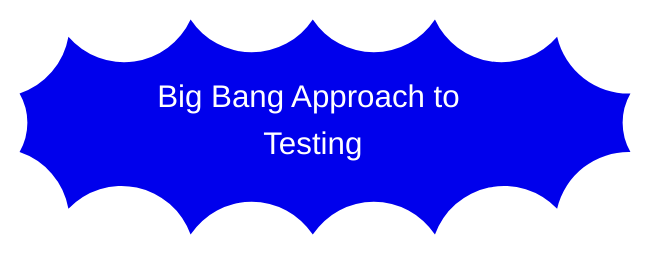
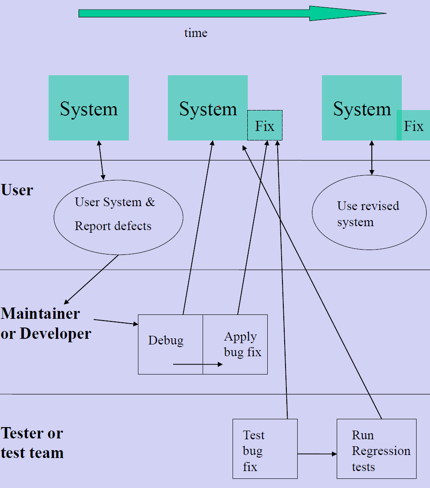
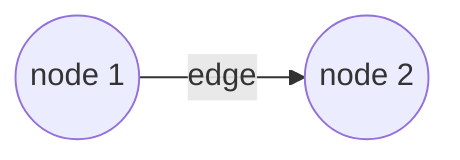
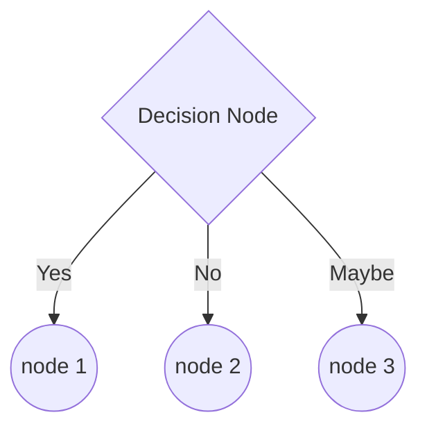
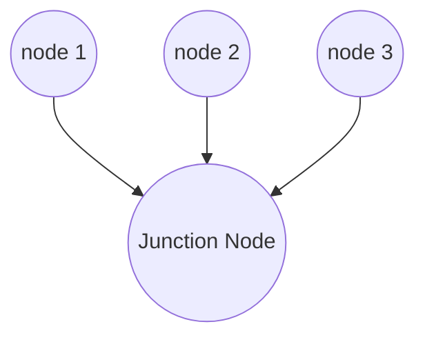
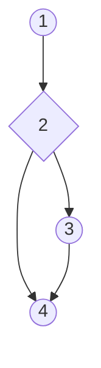


# Software Testing

## Introduction to Software Testing

- **Software testing** is the process of attempting to assess whether a software product will be acceptable to its end users, its target audience, its purchasers, and other stakeholders.
- Half the total labour needed to produce working software is testing activities !
- Bugs are always present even in well engineered software

## Goal of Software Testing

- The Goal of Software Testing is to increase to an ***acceptable level the users confidence*** that the system ***will behave correctly*** under ***all circumstances of interest***
- The purpose of testing is not:
  - To show that a program has bugs
- Can all bugs be removed by testing?

## Implications of the Goal of Software Testing

- Acceptable level of confidence must be defined
  - It’s important to ask how confident the user should be that the software works.
  - The more confident the user needs to be then the more emphasis to be placed on testing and bug prevention.

## Implications of the Goal of Software Testing 2

- Acceptable level of confidence must be defined
  - Level of confidence may be stated numerically
    - Number of tests successfully completed.
- Level of confidence may be based on residual defect discovery rate
  - Example - No P1 (Priority 1) bugs found in last 5 days testing

## Implications of the Goal of Software Testing 3

- Acceptable level of confidence must be defined
  - Testing can show the presence of defects but not prove their absence !!!!!.

## Implications of the Goal of Software Testing 4

- Correct behaviour must be defined.
  - What should the software do ?
  - The functional requirements of the software need to be clear as we need to **compare** *the actual behaviour with the specified behaviour*.
  - Use cases and scenarios define **what** the software should do.

## Implications of the Goal of Software Testing 5

Correct behaviour must be defined.



## Implications of the Goal of Software Testing 6

- Circumstances of interest must be defined.
  - In what context will the software operate and pick realistic inputs when testing.
  - It is necessary to try to predict how the software will actually be used. It’s often the case that users actually use software in ways not intended by the developers and this can result in system failures.

## Implications of the Goal of Software Testing 7

- Circumstances of interest must be defined.
- For example if software running a WEB server will process 10,000 orders each day during December and 1,000 each day for the rest of the year. Then the software needs to be tested for these circumstances.
- You also need to find out about the projected growth of the business.

## Testing Versus Debugging

Debugging is to find and fix the error in the code that led to the bug

| Testing                    | Debugging |
|----------------------------|-----------|
| Objective                  |           |
| Output                     |           |
| Knowledge of Design        |           |
| Responsibility (who's job) |           |

## Changing Ideas about Software Testing

- The ideas about software testing have changed over the years.
- Some of the old (incorrect) ideas are (still prevalent):
  - There is no difference between testing and debugging. Testing exists only to support debugging
  - Testing exists to show or prove the software works
  - Testing exists to show the software does not work

## Latest Ideas about Testing

- The Goal of Software Testing is to increase to an acceptable level the users confidence that the system will behave correctly under all circumstances of interest
- Testing reduces the perceived risk of software not working to an acceptable value.
- This results in low risk software without much testing effort.

## Software Testing 2

Levels of Testing & Functional and Structural Testing

## Static and Dynamic Approaches to Testing

- **Static:** Entails physical examination of work product (documentation or code) for agreement with governing specifications and standards
  - Examples include: - ***IN LECTURE***
  - For example: A programmer or team could carry out static analysis to determine the number of lines of code or branches in a system
- **Dynamic:** Entails executing a work product (code) and observing its behaviour for conformance to governing specifications  and standards.

## Examples

- For example a programmer or team may execute a set of tests so that all lines of code or all branches in the code are executed.
- For example a programmer or team may execute a particular  function (use case) in the system to see if it performs as it should.

## Functional Testing

- Known as black box testing or data driven testing
- Compare a components actual behaviour with it’s specified behaviour without regard to the components implementation
- For a given input observe the output to see if it meets specification and **don’t** try to see what went on inside the black box

## Functional Testing 2

- Checks out of domain outputs, inputs (invalid data)
- Function testing is about functionality **not** about programs implementation details. i.e. it takes users point of view.

## Scenarios and Use Cases can be used for Testing

- Scenarios and use cases can be used to test the system after it is built
  - The use cases provide a 'set of steps' needed to fun the software.
    - This guides the testers as to how to use the software and what the system should do
  - The scenarios provide actual test data.
    - The scenarios specify the input data and specify the output.
    - This is very useful in functional testing where we are testing the functionality of the software
      - In this situation we need to know what input data to supply to the system and what the expected output is.
        - We can then check if the actual output matches the expected output.

## Structural Testing

- Known as white box testing
- Explores the consistency of a components implementation with the design
- Structure tests execute **every** part of the structure (every line of code)
- You can't say a program is tested if some parts of it were never executed.
- Executes every path through the code (or a compromise if this is not possible)

## Structural Testing 2

- Concerned with what is going on inside the box (component).
  - Testing should cover all of the structure of the system so that every part of it gets tested.  

## Levels of Testing

- Inspections, walkthroughs and reviews.
- Unit testing
- Integration testing
- System testing
- Acceptance testing
- Maintenance testing and Regression testing

### Inspections

- Idea is to inspect the design prior to coding
- and to inspect code for errors and conformance to standards before dynamic testing

## Unit Testing

- Test a small piece ‘unit’ of code
  - method
- ensure that it matches the design documents.
- Structure tests followed by function tests.
- Unit testing is carried out by the programmer



> Unit testing ensures that individual components are ok.

## Unit Testing 2

- Functional and Structural testing applies to Unit testing:
  - During unit testing functional testing is concerned with the output from the unit (regarded as a black box) for given inputs.
  - During unit testing structural testing is concerned with ensuring that each statement, branch and LCSAJ has been exercised by some tests.

## Integration Testing

- This is testing that is applied to aggregations of related units.
- The goal is to ensure that the units work correctly together.
- Integration testing involves structure tests followed by function tests.
- The design documents will determine what the expected outputs are.
- The structural tests will execute *all paths between units and execute each unit*. The idea is to simulate the executing environment.
- The function tests will execute all specified functions of the aggregation of units and gradually build toward a complete system.



> Integration testing is about looking for errors in groups of units

## Integration Testing 2

- Functional and Structural testing applies to Integration testing:
  - During integration testing functional testing regards each subsystem (integration, part) as a black box and looks at the output for a given input.
  - During integration testing structural testing is concerned with ensuring that each part of the subsystem (integration, part) have been exercised by tests.

## System Testing

- System testing is a controlled test of completely integrated software executing on target hardware
- The goal is to make the software ready for user acceptance and to characterise the behavior of the system.
- Test scripts are used. Sometimes keyboard emulators are used also to facilitate automatic testing.
- In addition to testing that the functionality of the system is ok system testing also usually includes testing of performance, security, recovery, startup and shutdown.



## System Testing 2

- Functional and Structural testing applies to System testing:
  - During system testing functional testing is concerned with the input and output of the system level functions
  - During system testing structural testing is concerned with ensuring that all the systems subsystems (parts) have been exercised by tests.

## User Acceptance testing

- This is a test of the complete system in the actual user environment under operational or near-operational circumstances.
- The goal is to get the users acceptance of the system for operational use.
- User should be allowed to direct test procedure if desired.
- Users test the utility of user interfaces and operations manuals.
- Product managers usually sign off after user acceptance test where system is an external product.
- Sometimes user acceptance test is an external field test
  - Real situation
  - Real environment

## Regression Testing

- Regression testing  relates to testing of system which has had software changes applied.
- Regression testing ensures that the changes have not introduced defects in previously correct functions.
- Regression tests may be a subset of system, integration or unit tests.
  - ***EMPTY BLOCK***
- Regression test suite: A series of tests which is repeated when changes are made (During maintenance or development)
- Often regression test suite is automated testing
- Regression testing is sometimes referred to as 'round trip' testing.

## Regression testing



## Software Testing 3

- Path Testing
- Test Effectiveness

## Path Testing

- Testing paths through a component is largely a white box technique and is usually carried out during unit, integration and system testing.
- We need to be sure about the internal workings of software  so path testing is a way to build up confidence that the software will work properly.

## Path Testing 2

- Path testing involves static analysis to determine the structure of the software.
  - Need to develop Control-flow graphs
  - Build tables capturing information about the software such as:
    - Block Table
    - Branch table
    - LCSAJ table - Linear Code Sequence and Jump
- Path testing also involves dynamic analysis where we execute the software to determine which parts were actually tested.
- Path testing may be defined as testing of executable sequences of instructions through a program (method)

## Control-flow graph

- Testing of every path through a program is infeasible
  - A program with 3 IF statements has a total of 8 paths
- A Control-flow graph is a graphical representation of a programs control structure.
  - Can be developed
    - For a method
    - For a set of messages (such as to get a PieEater to eat a certain pie).
    - Usually develop flow graphs from code or from pseudocode.
- Flow graphs are similar to flowcharts
- But flow graphs are simpler in the sense that they don’t show whats in a process block.
- With flowcharts every part of process block is shown.
- So flowcharts have too much information for the purposes of understanding a programs control structure.

## Control-flow graphs 2



> Flow graphs consist of nodes and edges, an edge is a path between two nodes.



> Decision nodes are used to represent decisions in the Control-flow graph



> A junction node is used to represent a point where multiple paths converge

## Control-flow graphs 3

- A control-flow graph shows us the control structure (Static analysis) and is used to later test the system (dynamic analysis)
- The purpose of developing a flow graph is to determine control flow and to facilitate testing
- **Complete coverage**
- Complete coverage is achieved where we test every instruction (statement) at least once AND test every branch in each possible direction at least once.
- A program (method) should be tested so that at a minimum complete coverage is achieved.

## Basis paths for complete coverage

- Basis paths are a combination of paths that can be tested to result in complete coverage.
- Guarantees complete coverage
- Sometimes called basic paths
- The complexity formulae determines the maximum number of basis paths to ensure complete coverage.
- Sometimes fewer can be found
- Also called Cyclomatic complexity

## Cyclomatic complexity

For a single program with N nodes and E edges the complexity of the program is given by the formula:  
$M = E - N + 2$  
Where:

- $M$ is the complexity of the program.
- $E$ is the number of edges.
- $N$ is the number of nodes.
- 2 is a constant, which is added to the formula to account for the fact that a program must have at least one edge and one node.

## Control-flow graph example

A simple pseudocode example from a PieEater project.

```py
PieEaterA walk (MyGrid)
if MyGrid pieInsight = True
{
  PieEaterA eatPie(MyGrid)
}
PieEaterA reportStatus()
```

We can ignore the curly braces as they denote a process block and scope and are not part of the control structure. We can also ignore any blank lines.

**Nodes:**

| # | Code                        |
|---|-----------------------------|
| 1 | PieEaterA walk (MyGrid)     |
| 2 | If MyGrid pieInsight = True |
| 3 | PieEaterA eatPie(MyGrid)    |
| 4 | PieEaterA reportStatus()    |

**Edges:**

| # | From                         | To                          | Branch Type   |
|---|------------------------------|-----------------------------|---------------|
| 1 | PieEaterA walk (MyGrid)      | If MyGrid pieInsight = True | Unconditional |
| 2 | If MyGrid pieInsight = True  | PieEaterA eatPie(MyGrid)    | Conditional   |
| 3 | If MyGrid pieInsight = False | PieEaterA reportStatus()    | Conditional   |
| 4 | PieEaterA eatPie(MyGrid)     | PieEaterA reportStatus()    | Unconditional |



- $N = 4$  
- $E = 4$  
- $M = E - N + 2$  
- $M = 4 - 4 + 2$
- $M = 2$

## Test Effectiveness Ratios and Coverage Measures

TER - Test Effectiveness Ratios

- Test effective ratios and coverage measures can both be used to assess how well code is tested.
- Use both static and dynamic approach to testing.
- For example TER1 and C0 both relate the number of lines of code tested to the total lines of code.
- Both TERs and Coverage measures are used in industry.
- The various aspects to path testing such as developing the flow graphs and then testing the paths build up confidence

## Test Effectiveness Ratios

- TER1 is the number of executable statements exercised at least once  divided by the total number of executable statements.
- TER2 is the number of branches exercised at least once  divided by the total number branches.
- TER3 is the number of LCSAJs (linear code sequence and jump) exercised at least once  divided by the total number LCSAJs.
- If TER3 = 1 ie all LCSAJs tested then this implies that TER2 and TER1 are both 1.

## Coverage Measures

- C0 is equivalent to TER1
  - ie $C0 = TER1 * 100$
  - ie TER1 is a ratio where as $C0$ is a percentage
- C1 is equivalent to TER2
  - ie $C1 = TER2 * 100$
- Ct is 100 \* (the number of paths tested divided by the total number of paths)
- C0 and TER1 are measure the lowest level of testing ie very basic testing
- C1 and TER2 measure basic testing
- TER3 measures advanced testing
- Ct is not feasible except for simple programs.

## Complete Coverage

- Complete coverage is where you test all the statements and all the branches
  - $C0 = 100$ so $TER1 =1$ and $C1 = 100$ so $TER2 = 1$
  - You **MUST** test so that you achieve complete coverage
- If programmers do not focus on testing they normally achieve $C1$ of 25 to 50%.
  - To achieve higher levels a method involving structured test planning, dynamic operation of the program and a lot of study of the source code is required

## Statement Testing

- Type of structural testing measured by TER1.
- The two aspects of static analysis and instrumentation are used.
  - Static analysis – to count total number of lines of code.
  - Instrumentation – to record all lines of code executed by a test or set of tests.
- Instrumenting code
  - Manually – Trace, Debug or Print statements
  - Software Test tool – dynamic analyser
- Major problem with statement testing is branches
  - If $X > 0 \text{ then } X = 2 * X \text{ else } X = 0$
- When executed the above would be counted in the TER 1 count of executed statements, even if X is never negative.

## Branch Testing

- Type of structural testing measured by TER2.
- The two aspects of static analysis and instrumentation are used.
  - Static analysis – to count total number of branches in the code.
  - Instrumentation – to record all branches in the code that are executed by a test or set of tests.
- Branch testing ensures that all branches are executed.

## Branch Testing 2

- Conditional branches
  - Conditional branches depend on some condition
  - Examples
    - TRUE and FALSE branches of an IF
    - A conditional loop
- Unconditional branches
  - A branch where there is no condition
  - Automatic transfer of control
  - Examples
    - The branch around the ELSE part of an IF statement
      - ie after the TRUE part of an IF is executed there is an unconditional branch around the FALSE part.
    - The branch back to the beginning of a loop
      - To test the loop condition

## Branch Testing 3

- Major problem with branch testing is testing combinations of branches
- For example:

```vb
IF X < 0 then
{
  x = x -1
}
ELSE
{
  x = x + 1
}
IF Y < 0  then
{
  Z = SQRT (-X)
}
ELSE
{
  Z = X + Y
}
```

## Branch Testing 4

In the last example we can test to TER 2 = 1 with two tests

- One test with both X and Y negative
  - This executes both of the TRUE parts of IFs
- Another test with both X and Y positive
  - This executes both of the FALSE parts of Ifs
- However this does not uncover the problem where X is positive and Y is negative
  - Results in taking the SQRT of a negative number – a big problem !

## How Test Effectiveness and Coverage Measures are used in practice

- The code is statically analysed.
  - To determine the number of statements, the branches and LCSAJs.
- A test data set is constructed for the software.
  - For example test data determined which will test the various statements, branches and LCSAJs.
- The code is tested and the test runs dynamically analysed
  - For example determine which branches or LCSAJs are exercised
- The results are inspected for statements, branches and LCSAJs not exercised.

## How much testing ?

- You should at a minimum test so that complete coverage is achieved.
- TER 1 = 1 and TER 2 = 1 and TER 3 approaching 1
  - Ie TER 3 of 0.75
  - Implies C0 = 100% and C1 = 100%

## Process Data to capture during testing

- Number of Defects in each category
- Defect severity
- Defect isolation and repair cost
  - Debug time, labour hours, machine time
- Analysis of collected data can lead to process improvement and then to defect avoidance
  - Better specifications and better software
  - Higher quality
  - Shorter development time
  - Lower more predictable development costs.

## Software Testing & Prototyping

- Basic Blocks
- Block, branch and LCSAJ tables

## Basic Blocks

The example below has 2 IF statements

```vb
IF X < 0 then
{
  x = x -1
}
ELSE
{
  x = x + 1
}
IF Y < 0  then
{
  Z = SQRT (-X)
}
ELSE
{
  Z = X + Y
}
```

## Basic Blocks 2

- There are 4 paths through the previous program
  - X < 0 and Y < 0
  - X < 0 and Y >= 0
  - X >= 0 and Y < 0
  - X >= 0 and Y >= 0
- A rigorous technique is needed for more complex programs
- A path through a program is made up of combinations of statements, but these combinations are not random.
  - The number of possible different paths is determined by the number of branches in the program and not by the number of statements.
  - A program with one IF statement has more branches than a program with 20 assignment statements.

## Basic Blocks 3

- The chunks of code that can be regarded as one unit for branch or path testing is called a basic block
- A basic block is defined as a group of statements which are always executed together.
- A basic block has one entry point and one exit point and will contain no internal branches.
  - Otherwise it would not always be executed as one group.

A simple pseudocode example from a PieEater project.

## Example

```vb
PieEaterA walk (MyGrid)
IF MyGrid pieInsight = True
{
  PieEaterA eatPie(MyGrid)
}
PieEaterA reportStatus()
```

**Lines:**

No need to number blank lines or lines with curly braces.

| # | Code                          |
|---|-------------------------------|
| 1 | `PieEaterA walk (MyGrid)`     |
| 2 | `IF MyGrid pieInsight = True` |
| 3 | `PieEaterA eatPie(MyGrid)`    |
| 4 | `PieEaterA reportStatus()`    |

## Example branch table

- The branch table consists of columns for the Branch number, From Line, To Line and Branch Type
- Branch table for last example

Branch Table

| Branch No. | From Line # | To Line # | Branch Type   | From Line                              | To Line                       |
|:-----------|:------------|:----------|:--------------|:---------------------------------------|:------------------------------|
| 1          | 1           | 2         | Unconditional | `PieEaterA walk (MyGrid)`              | `IF MyGrid pieInsight = True` |
| 2          | 2           | 3         | Conditional   | `IF MyGrid pieInsight = True` is True  | `PieEaterA eatPie(MyGrid)`    |
| 3          | 2           | 4         | Conditional   | `IF MyGrid pieInsight = True` is False | `PieEaterA reportStatus()`    |
| 4          | 3           | 4         | Unconditional | `PieEaterA eatPie(MyGrid)`             | `PieEaterA reportStatus()`    |

## Example Blocks table

- The Block Table consists of Block Number, Start Line and End Line
- Block table for last example

| Block Number | Start Line # | End Line # | From Line                     | To Line                    |
|:-------------|--------------|------------|-------------------------------|----------------------------|
| 1            | 1            | 1          | `PieEaterA walk (MyGrid)`     | `...`                      |
| 2            | 2            | 3          | `IF MyGrid pieInsight = True` | `PieEaterA reportStatus()` |
| 3            | 4            | 4          | `PieEaterA reportStatus()`    | `...`                      |

`...` indicates that the To Line code is the same as the From Line code

## Software Testing & Prototyping 2

LCASJs and LCSAJ tables

## Linear code Sequence and Jump

- LCSAJ testing is an intermediate step between testing all the branches and testing all the paths in a program.
- A linear code sequence and jump is a body of code through which the flow of control can proceed sequentially and which is terminated by a jump.
- An LCSAJ table consists of three things
  - Start Line, End Line and Target Line
  - The start line is the first line in a linear sequence
  - The End Line is the last line in a linear sequence
  - The target line is a line to which a jump is made.

## Steps to determine all LCSAJs for a given program or method using branch, block tables and code

1. Examine the To line column in the branch table for any line numbers to which control is transferred by means of a jump (i.e. The From line and the To line differ by more than one.)
   Construct a sorted list (ascending) of the line numbers (To lines) that meet this criterion and add on the line number of the first executable statement.
2. Determine the end lines for each line in the start list by tracing linear sequences of code from each start line. In general there will be more than one LCSAJ starting at each start line. (Look at the code and the Block Table for this)
3. For each end line (in the linear sequence) look up it’s equivalent To line in the branch table, this gives the target line.

## Applying previous steps to the previous example

```vb
PieEaterA walk (MyGrid)
IF MyGrid pieInsight = True
{
  PieEaterA eatPie(MyGrid)
}
PieEaterA reportStatus()
```

**Branch Table:**

| Branch No.       | From Line | To Line | Branch Type |
|:-----------------|:----------|:--------|:------------|
|                  |           |         |             |

| Block Number | Start Line | End Line |
|:-----------------|----------------|--------------|
|                  |                |              |

Applying previous steps to the previous example

1. Examine the To line column in the branch table for any line numbers to which control is transferred by means of a jump
   Construct a sorted list of the line numbers (To lines) that meet this criterion and add on the line number of the first executable statement and leave out last line. Gives 1, 6
2. Determine the end lines for each line in the start list by tracing linear sequences of code from each start line. In general there will be more than one LCSAJ starting at each start line. (Look at the code and the Block Table for this).
   The first LCSAJ starts at line 1 and look in the block table to see where this block ends gives 2.
3. For each end line (in the linear sequence) look up it’s equivalent To line in the branch table, this gives the target line. So this gives 6. So the first LCSAJ is Start Line of 1, End line of 2 and Target Line of 6

There are other LCSAJs starting at 1 as the linear sequence extends beyond 2 and into the next block (look at code). The second block ends at 5 and look in the branch table to see if there is a jump from 5. There is not so look at the code to see if the linear sequence extends beyond 5 and into the next block and it does. So the linear sequence extends into the third block. The third block ends at 6 and look in the branch table to see if there is a jump from 6. There is 6 to exit.

So the second LCSAJ is

- Start Line of 1, End line of 6 and Target Line of Exit

There are no more LCSAJs starting at line 1:

- so now we look for LCSAJs starting at the next element in the start list which is 6.

By continuing on as described previously

- yields a third LCSAJ is
- Start Line of 6, End line of 6 and Target Line of Exit

## LCSAJ Table for Previous Example

**LCSAJ table:**

| LCSAJ No.       | Start Line | End Line | Target |
|:----------------|:-----------|:---------|:-------|
|                 |            |          |        |
|                 |            |          |        |
|                 |            |          |        |
|                 |            |          |        |
